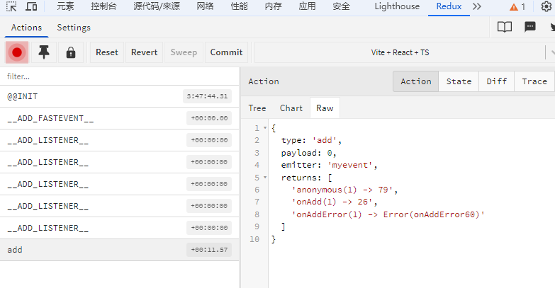

# Development Tools

`FastEvent` provides debugging tools that allow you to inspect triggered events, listener counts, and other information in `Redux DevTools`.

## Installation and Usage Steps

### Step 1: Install Redux DevTools

1. For `Chrome` browser:

    - Visit [Chrome Web Store](https://chrome.google.com/webstore/detail/redux-devtools/lmhkpmbekcpmknklioeibfkpmmfibljd)
    - Click "Add to Chrome" to install the extension

2. For `Firefox` browser:
    - Visit [Firefox Add-ons](https://addons.mozilla.org/en-US/firefox/addon/reduxdevtools/)
    - Click "Add to Firefox" to install the extension

### Step 2: Use in Code

Import `fastevent/devtools` in your application entry file and enable `debug=true`.

```javascript
import 'fastevent/devtools';
import { FastEvent } from 'fastevent';

const emitter = new FastEvent({
    debug: true, // [!code++]
});
```

### Step 3: View Debug Information

1. Open your application page
2. Press `F12` to open browser developer tools
3. Find the `Redux` tab (if not visible, click `>>` to expand more tabs)
4. In `Redux DevTools` you can see:
    - Event trigger records
    - Event payload and meta data
    - Subscriptions and unsubscriptions
    - Number of retained messages
    - Listener return values and call counts

Every time an event is triggered, you can see detailed state change information in `Redux DevTools`, which is very helpful for debugging and understanding the event flow in your application.

