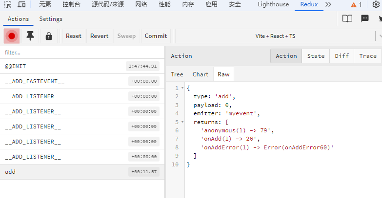

# 调试工具

`FastEvent` 提供了调试工具，可以在`Redux DevTools`中查看触发的事件、监听器数量等信息。

## 安装和使用步骤

### 第 1 步：安装 Redux DevTools

1. 对于 `Chrome` 浏览器：

    - 访问 [Chrome Web Store](https://chrome.google.com/webstore/detail/redux-devtools/lmhkpmbekcpmknklioeibfkpmmfibljd)
    - 点击"添加至 Chrome"安装扩展

2. 对于 `Firefox` 浏览器：
    - 访问 [Firefox Add-ons](https://addons.mozilla.org/en-US/firefox/addon/reduxdevtools/)
    - 点击"添加到 Firefox"安装扩展

### 第 2 步：在代码中使用

在你的应用入口文件中导入`fastevent/devtools`,并开启`debug=true`.

```javascript
import 'fastevent/devtools';
import { FastEvent } from 'fastevent';

const emitter = new FastEvent({
    debug: true, // [!code ++]
});
```

### 第 3 步：查看调试信息

1. 打开你的应用页面
2. 按 `12` 打开浏览器开发者工具
3. 找到 `Redux` 标签页（如果看不到，点击 `>>` 展开更多标签）
4. 在 `Redux DevTools` 中你可以看到：
    - 事件的触发记录
    - 事件的 payload 和 meta 数据
    - 订阅与取消订阅
    - 保留消息数量
    - 监听器的返回值以及调用次数

每次事件触发时，你都可以在`Redux DevTools`中看到详细的状态变化信息，这对于调试和理解应用的事件流非常有帮助。


