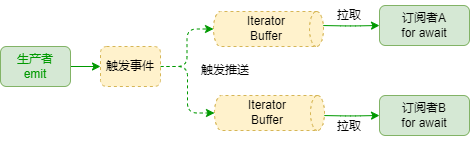

# 异步事件迭代器

## 概述

使用`on/onAny`时如果没有指定有效的监听器函数时，返回一个异步事件迭代器`FastEventIterator`，允许通过`for await (const messages of emitter.on(<事件>))`的形式订阅事件。

```typescript
import { FastEvent } from "@fastevent/core";

const emitter = new FastEvent();
// 发送事件
emitter.emit("user/login", { userId: 123 });
// 订阅事件
for await (const message of emitter.on("user/login")) {
    console.log("用户登录:", message.payload);
}
```

## 指南

### 拉模式

不同的一般通过普通监听器的订阅事件的方式，使用`异步事件迭代`消费事件消息是典型的拉模式。

- 常规订阅事件是推模式，事件触发者（即生产者）将事件消息推送给订阅者（即消费者）。
- 而使用`异步事件迭代`消费事件消息则是拉模式，由订阅者主动拉取消息。



### 缓冲区

在返回异步迭代器时(即拉模式下)，会为每一个订阅者创建`FastEventIterator`，内部自动创建一个`FIFO`消息缓冲区。
事件消费者通过`for await`从消息缓冲区拉取消息。

默认的消息缓冲区参数如下：

```ts
{
    overflow: "slide",
    size: 20,
    maxExpandSize: 100,
    expandOverflow
}
```

- 缓冲区默认大小`size=20`
- 当缓冲区溢出时,默认`overflow=expand`，表示自动扩展缓冲区到`maxExpandSize=100`
- 当扩展到`maxExpandSize=100`时，根据`expandOverflow=slide`移除最旧的消息

### 消息存活时间

当消息被放入缓冲区后，可以配置`lifetime`参数用于指定消息在缓冲区中的最大存活时间，超过时会自动丢弃。

```ts
const messages = emitter.on("count", {
    iterator: {
        // 最大存活时间1分钟,超过自动丢弃
        lifetime: 60 * 1000, // [!code ++]
    },
});
```

### 取消订阅

异步迭代器订阅可以通过以下方式取消订阅：

- **通过传入一个`AbortSignal`信号来取消**

```ts
const abortController = new AbortController();
const messages = emitter.on("count", {
    iterator: {
        signal: abortController.signal, // [!code ++]
    },
});
setTimeout(() => {
    abortController.abort();
});
for await (const message of messages) {
    console.log(message);
}
```

- 从`for await`迭代过程结束时自动取消

在`for await`迭代过程中，执行`return`、`break`或触发错误时自动取消订阅

```ts
const abortController = new AbortController();
const messages = emitter.on("count");

for await (const message of messages) {
    console.log(message);
    // 1. 触发错误退出异步迭代
    throw new Error("触发错误");
    // 2. 中止循环
    break;
    // 3. 返回
    return;
}
// 退出迭代后自动取消订阅
```

### 配置参数

```ts
export interface FastEventIteratorOptions<T = FastEventMessage> {
    /** 缓冲区默认大小（默认：20） */
    size?: number;
    /** 缓冲区扩展到多大时不再扩展（默认：100） */
    maxExpandSize?: number;
    /** 当扩展到最大大小后的溢出策略（默认：'slide'） */
    expandOverflow?: Omit<FastQueueOverflows, "expand">;
    /** 溢出策略（默认：'slide'） */
    overflow?: FastQueueOverflows;
    /** 消息生命周期（毫秒），0表示不启用（默认：0） */
    lifetime?: number;
    /** 当新消息到达时触发此回调 */
    onPush?: (newMessage: T, messages: [T, number][]) => void;
    /** 当消息被弹出时触发此回调，可以在此对消息队列进行排序等操作 */
    onPop?: (messages: [T, number][], hasNew: boolean) => [T, number] | undefined;
    /** 当消息被丢弃时触发此回调 */
    onDrop?: (message: T) => void;
    /** 错误处理函数，返回true表示继续迭代，false表示停止迭代 */
    onError?: (error: Error) => boolean | Promise<boolean>;
    /** 信号，用于取消迭代 */
    signal?: AbortSignal;
}
```
