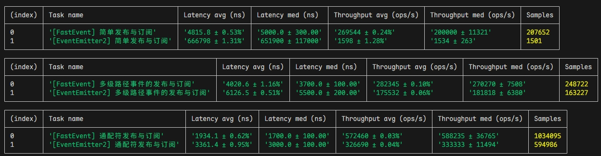

# FastEvent

FastEvent 是一个功能强大的`TypeScript`事件管理库，提供了灵活的事件订阅和发布机制，支持事件通配符、作用域、异步事件等特性。

对比`EventEmitter2`，`FastEvent`具有以下优势：

-   `FastEvent`的性能比`EventEmitter2`高 `1~2`倍左右。
-   `FastEvent`包大小为 `6.xkb`，而`EventEmitter2`为 `43.4kb`。
-   `FastEvent`拥有更丰富的功能。

# 安装

使用 npm 安装:

```bash
npm install fastevent
```

或使用 yarn:

```bash
yarn add fastevent
```

# 快速入门

## 基本使用

```typescript
import { FastEvent } from 'fastevent';

// 创建事件实例
const events = new FastEvent();

// 订阅事件
events.on('user/login', (message) => {
    console.log('用户登录:', message.payload);
    console.log('事件类型:', message.type);
    console.log('元数据:', message.meta);
});

// 发布事件 - 方式1：参数形式
events.emit('user/login', { id: 1, name: 'Alice' });

// 发布事件 - 方式2：消息对象形式
events.emit({
    type: 'user/login',
    payload: { id: 1, name: 'Alice' },
    meta: { timestamp: Date.now() },
});
```

# 指南

## 事件消息格式

FastEvent 使用标准化的消息格式处理所有事件：

```typescript
type FastEventMessage<T = string, P = any, M = unknown> = {
    type: T; // 事件类型
    payload: P; // 事件数据
    meta: M; // 事件元数据
};
```

事件监听器始终接收这个消息对象，提供了一致的方式来访问事件数据和元数据。

## 事件通配符

FastEvent 支持两种通配符：

-   `*`: 匹配单层路径
-   `**`: 匹配多层路径

```typescript
const events = new FastEvent();

// 匹配 user/*/login
events.on('user/*/login', (message) => {
    console.log('任何用户类型的登录:', message.payload);
});

// 匹配 user 下的所有事件
events.on('user/**', (message) => {
    console.log('所有用户相关事件:', message.payload);
});

// 触发事件
events.emit('user/admin/login', { id: 1 }); // 两个处理器都会被调用
events.emit('user/admin/profile/update', { name: 'New' }); // 只有 ** 处理器会被调用
```

## 事件作用域

作用域允许你在特定的命名空间下处理事件。注意，作用域与父事件发射器共享相同的监听器表：

```typescript
const events = new FastEvent();

// 创建用户相关的作用域
const userScope = events.scope('user');

// 以下两种方式等效：
userScope.on('login', handler);
events.on('user/login', handler);

// 以下两种方式也等效：
userScope.emit('login', data);
events.emit('user/login', data);

// 清除作用域中的所有监听器
userScope.offAll(); // 等效于 events.offAll('user')
```

## 监听器选项

订阅事件时可以指定额外的选项：

```typescript
interface FastEventListenOptions {
    // 监听器被调用的次数（0表示无限次，1表示一次）
    count?: number;
    // 将监听器添加到监听器数组的开头
    prepend?: boolean;
}

// 示例：监听前3次事件
events.on('data', handler, { count: 3 });

// 示例：确保处理器在其他监听器之前被调用
events.on('important', handler, { prepend: true });
```

## 移除监听器

FastEvent 提供多种移除监听器的方式：

```typescript
// 移除特定监听器
events.off(listener);

// 移除某个事件的所有监听器
events.off('user/login');

// 移除某个事件的特定监听器
events.off('user/login', listener);

// 使用通配符模式移除监听器
events.off('user/*');

// 移除所有监听器
events.offAll();

// 移除某个前缀下的所有监听器
events.offAll('user');
```

## 一次性事件

使用 `once` 订阅只触发一次的事件：

```typescript
const events = new FastEvent();

events.once('startup', () => {
    console.log('应用启动');
});

// 等效于：
events.on('startup', handler, { count: 1 });
```

## 异步事件

支持异步事件处理：

```typescript
const events = new FastEvent();

events.on('data/fetch', async () => {
    const response = await fetch('https://api.example.com/data');
    return await response.json();
});

// 异步发布事件返回所有结果/错误的数组
const results = await events.emitAsync('data/fetch');
console.log('所有处理器的结果:', results);
```

## 监听器返回值

`emit` 和 `emitAsync` 方法都会返回所有事件监听器的执行结果：

```typescript
const events = new FastEvent();

// 同步监听器的返回值
events.on('calculate', () => 1);
events.on('calculate', () => 2);
events.on('calculate', () => 3);

// 获取返回值数组
const results = events.emit('calculate');
console.log('结果:', results); // [1, 2, 3]

// 异步监听器
events.on('process', async () => '结果 1');
events.on('process', async () => '结果 2');

// 获取异步结果/错误数组
const asyncResults = await events.emitAsync('process');
console.log('异步结果:', asyncResults); // ['结果 1', '结果 2']
```

对于异步事件，`emitAsync` 会等待所有监听器完成执行，并返回一个数组，包含所有监听器的解析值，如果监听器执行失败则包含错误对象。

## 事件等待

使用 `waitFor` 等待特定事件发生：

```typescript
const events = new FastEvent();

async function waitForLogin() {
    try {
        // 等待登录事件，超时时间 5 秒
        const userData = await events.waitFor('user/login', 5000);
        console.log('用户已登录:', userData);
    } catch (error) {
        console.log('登录等待超时');
    }
}

waitForLogin();
// 稍后触发登录事件
events.emit('user/login', { id: 1, name: 'Alice' });
```

## 保留事件数据

保留最后一次事件数据，新的订阅者会立即收到该数据：

```typescript
const events = new FastEvent();

// 发布事件并保留
events.emit('config/update', { theme: 'dark' }, true);

// 之后的订阅者会立即收到保留的数据
events.on('config/update', (message) => {
    console.log('配置:', message.payload); // 立即输出: 配置: { theme: 'dark' }
});
```

## 多级事件

支持发布和订阅多级事件。

默认使用 `/` 作为事件路径分隔符，你也可以使用自定义的分隔符：

```typescript
const events = new FastEvent({
    delimiter: '.',
});
```

## 全局事件监听

使用 `onAny` 监听所有事件：

```typescript
const events = new FastEvent();

events.onAny((message) => {
    console.log(`事件 ${message.type} 被触发:`, message.payload);
});

// 也可以使用 prepend 选项
events.onAny(handler, { prepend: true });
```

## 元数据(Meta)

元数据是一种为事件提供额外上下文信息的机制。你可以在全局范围内设置元数据，也可以为单个事件添加特定的元数据。

### 全局元数据

在创建 FastEvent 实例时设置全局元数据：

```typescript
const events = new FastEvent({
    meta: {
        version: '1.0',
        environment: 'production',
    },
});

events.on('user/login', (message) => {
    console.log('事件数据:', message.payload);
    console.log('元数据:', message.meta); // 包含 type、version 和 environment
});
```

### 事件特定元数据

在发布事件时可以传递额外的元数据，它会与全局元数据合并：

```typescript
const events = new FastEvent({
    meta: { app: 'MyApp' },
});

// 在发布事件时添加特定的元数据
events.emit(
    'order/create',
    { orderId: '123' }, // 事件数据
    false, // 不保留
    { timestamp: Date.now() }, // 事件特定的元数据
);

// 监听器接收合并后的元数据
events.on('order/create', (message) => {
    console.log('订单:', message.payload); // { orderId: '123' }
    console.log('元数据:', message.meta); // { type: 'order/create', app: 'MyApp', timestamp: ... }
});
```

## 错误处理

FastEvent 提供了错误处理机制：

```typescript
const events = new FastEvent({
    ignoreErrors: true, // 默认为 true，不会抛出错误
    onListenerError: (type, error) => {
        console.error(`处理事件 ${type} 时发生错误:`, error);
    },
});

events.on('process', () => {
    throw new Error('处理失败');
});

// 不会抛出错误，而是触发 onListenerError
events.emit('process');
```

## TypeScript 类型支持

FastEvent 使用 TypeScript 编写，提供完整的类型支持：

```typescript
// 定义事件类型
interface MyEvents {
    'user/login': { id: number; name: string };
    'user/logout': { id: number };
}

// 创建带类型的事件发射器
const events = new FastEvent<MyEvents>();

// 事件名称和数据类型检查
events.on('user/login', (message) => {
    // message.payload 的类型为 { id: number; name: string }
    const { id, name } = message.payload;
});

// 错误：错误的事件名称
events.emit('wrong/event', {});

// 错误：错误的数据类型
events.emit('user/login', { wrong: 'type' });
```

## 自定义选项

FastEvent 构造函数支持多个选项：

```typescript
const events = new FastEvent({
  // 事件路径分隔符，默认为 '/'
  delimiter: '.',
  // 事件处理器的上下文
  context: null,
  // 元数据，会传递给所有事件处理器
  meta: { ... },

  // 错误处理
  ignoreErrors: true,
  onListenerError: (type, error) => {
    console.error(`事件错误:`, type, error);
  },

  // 监听器添加/移除的回调
  onAddListener: (path, listener) => {
    console.log('添加监听器:', path);
  },
  onRemoveListener: (path, listener) => {
    console.log('移除监听器:', path);
  }
});
```

# 性能


